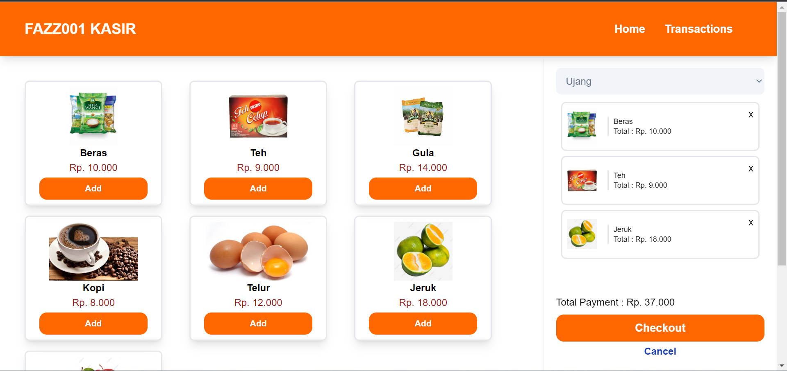
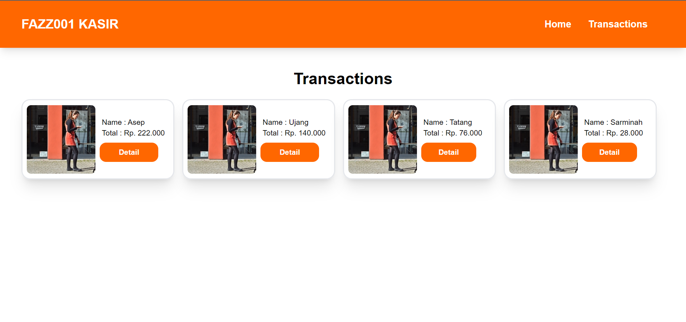
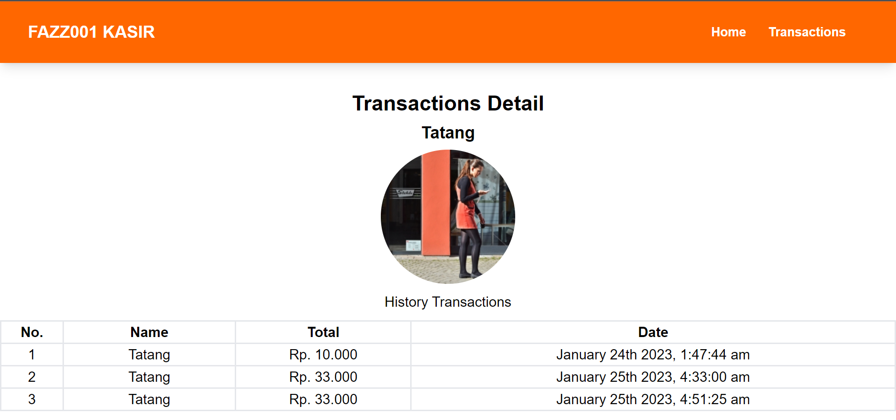

# FAZZ001 SI Kasir

<br/>

## How Run to Local

---

- import database MysQL
- import collections postman for API platform

#### POSTMAN Collections

or look api collections postman :
<https://api.postman.com/collections/18051667-9111a862-77ef-435f-b627-15c46702a7f7?access_key=PMAT-01GR79XCX671ZPPG2N6XJGX2GA>

##### Documentations :

###### `Documentation SI Users` <https://documenter.getpostman.com/view/18051667/2s935kP62c>

  <br/>

### How Run Server

---

into directory :

```
cd server
```

install Dependencies :

```
npm install
```

Setup Envirotment File :
<br/>
create an .env file in the server folder, and copy the contents of .env.example to .env

run app :

```
npm run start
```

or (always restart after change coding/develop mode)

```
npm run dev
```

Open http://localhost:8000 or your ipv4/virtual host, example : http://192.168.56.258:8000 to view it in your browser.

<br/>

### Run Client

---

- Open Directory client :

```
cd client
```

- install Dependencies :

```
npm install
```

- Fix Link :

```
npm run lint
```

- Run App :

```
npm run dev
```

<br/>

### Screenshot

---

<br/>

- Home



- transactions



- transactions detail



<br/>

### Example Deployment

---

### `Server` <>

### `Frontend` <>
